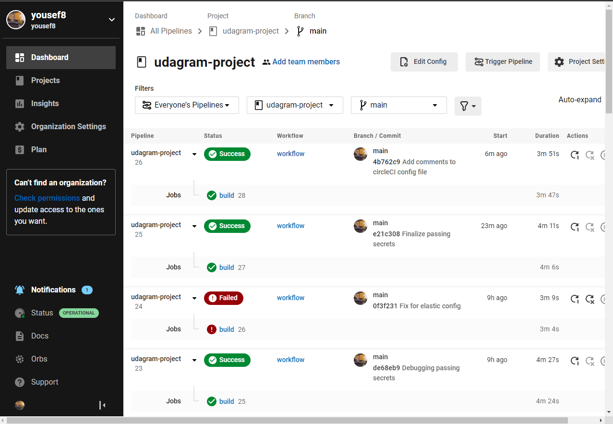
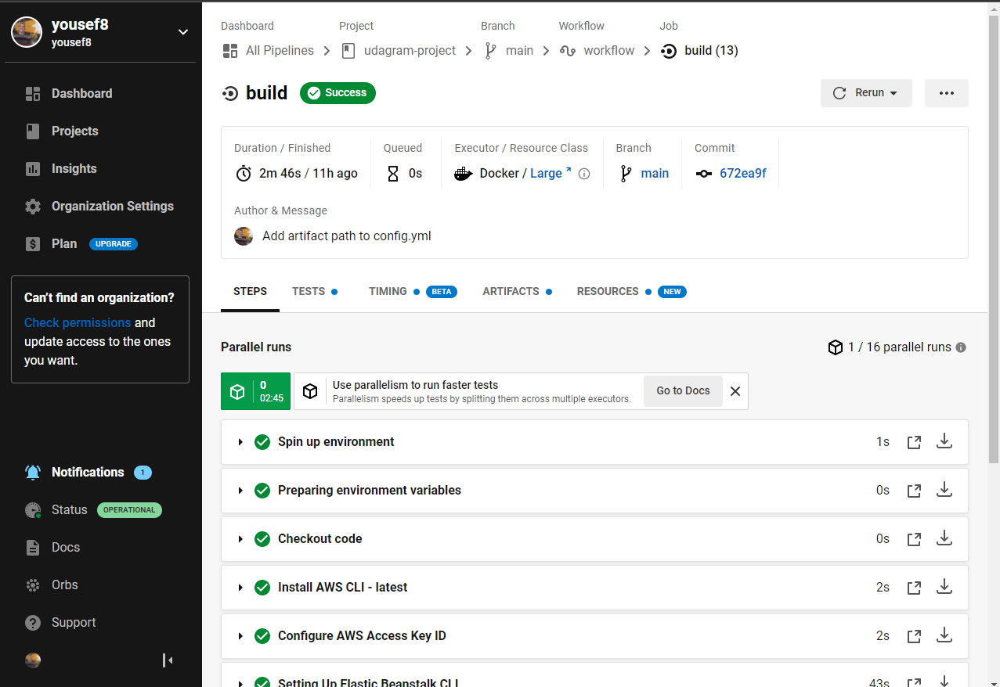
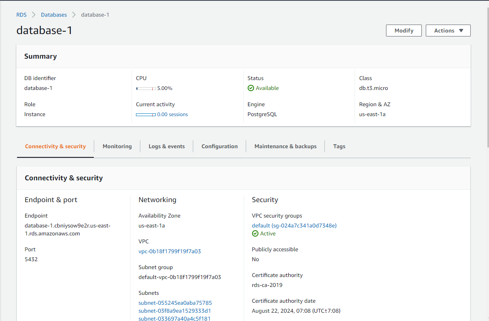
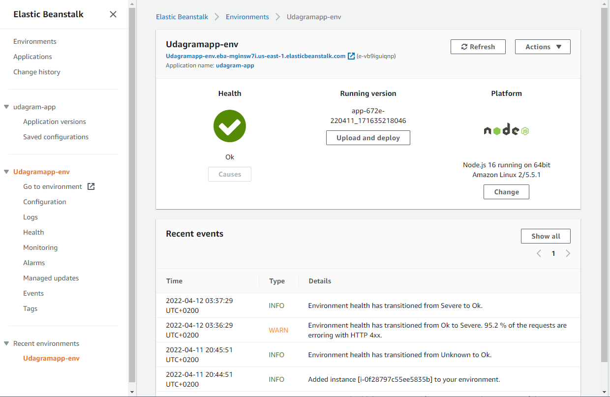
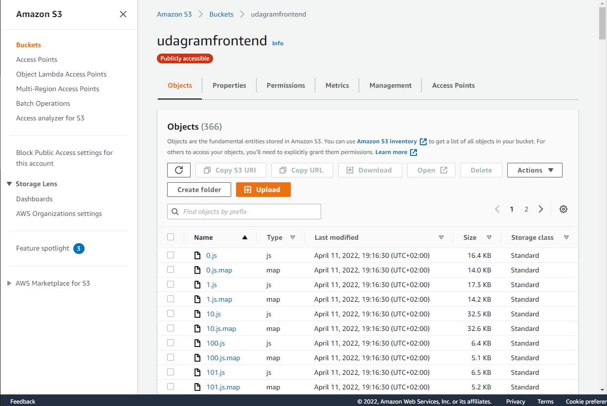
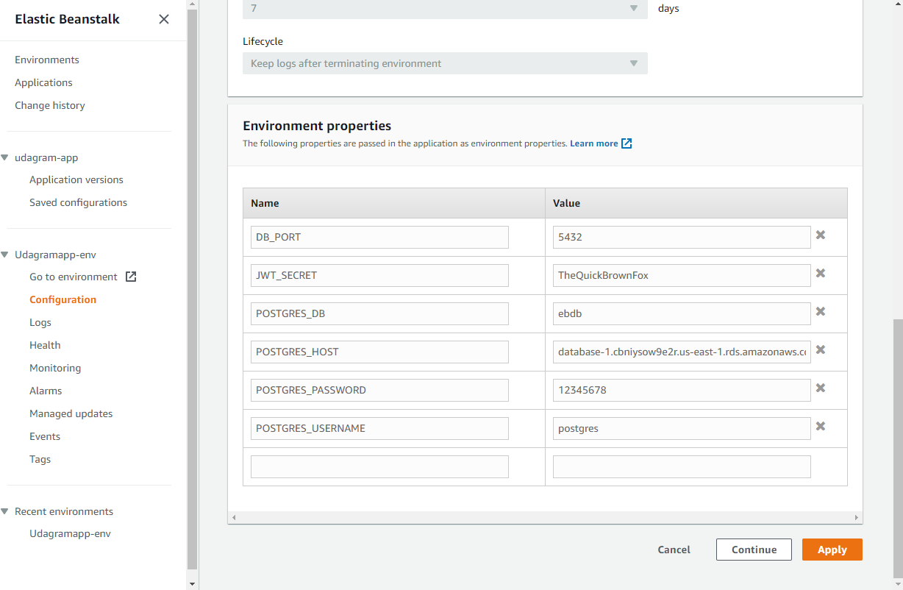
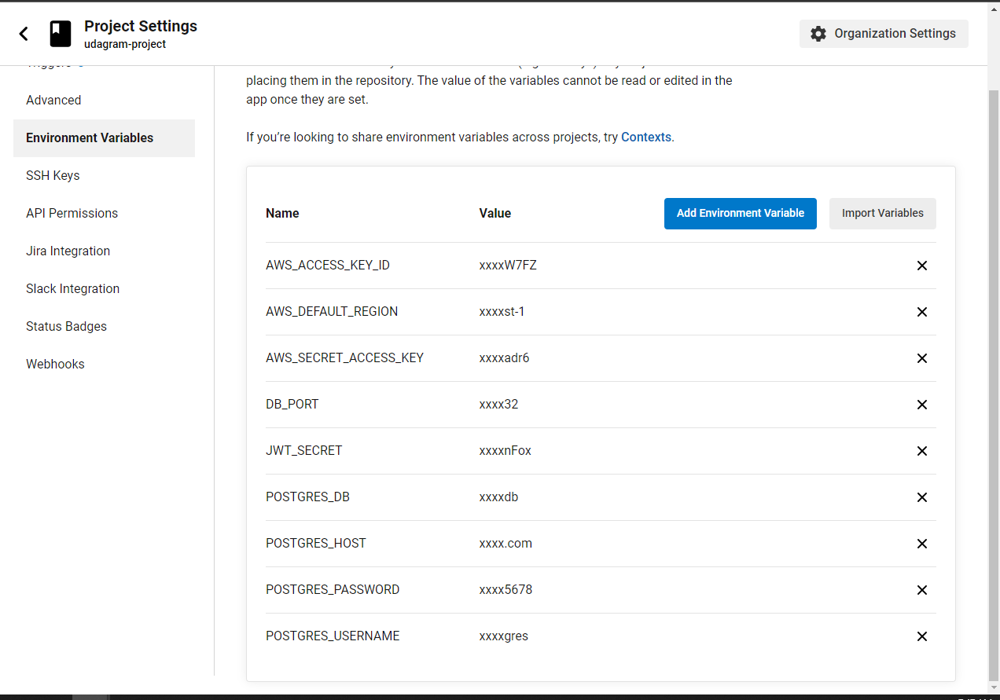
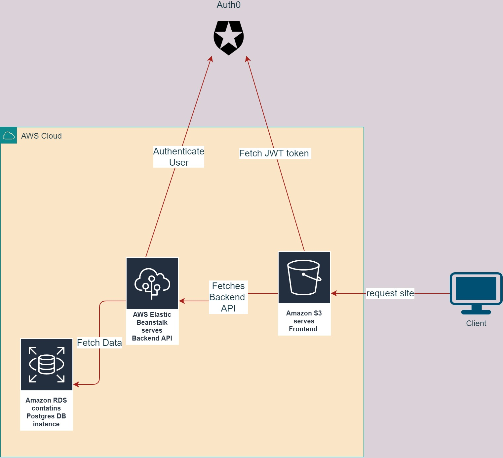
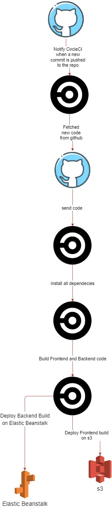

# Udagram

This is the third project in Full-Stack Javascript Developer Nanodegree.

This project demonstrates how to make a CI/CD pipeline to deploy the a project.

The code used in this project is a starter code.

[CircleCI](https://circleci.com/) was used for making the pipeline.

[AWS](https://aws.amazon.com/) was used to deploy hte project.

## Demo-Preview

You can see the site Deployed and working correctly from this [Link](http://udagramfrontend.s3-website-us-east-1.amazonaws.com/home).

## Prerequist

- Nodejs should be installed

## Installation

- Clone this project.
- In the root folder of the project:
  - run "npm run install:frontend" to install all frontend dependenciess
  - run "npm run install:backend" to install all backend dependencies

## CI/CD Build status

Screenshots for the last build

## AWS services status

Here I will include screenshots for the the three AWS services used in deploying the code (RDS, EB, s3) to show their successful status.

- RDS

- ElasticBeanstalk

- s3

## Environment variables

- Image showed below contains Elastic Beanstalk environment variables

- Image showed below contains CircleCI project environment variables

## Infrastructure Diagram

## Pipeline Diagram

